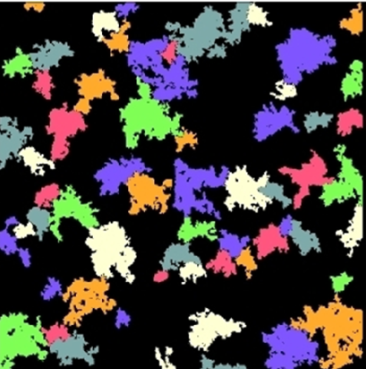

# :man_technologist: :crown: **IT-Crowns Project**

    

## :man_technologist: :crown: IT-Crowns team project of a complete ML pipeline solving the task of panoptic segmentation for aerial drone images collected at the Alferevo airfield :small_airplane:

## :robot: :shower: ML Pipeline Details

- ### :boxing_glove: Training Dataset — [Semantic Drone Dataset](https://www.tugraz.at/index.php?id=22387)

- ### :toolbox: Model Frameworks — [Detectron 2](https://github.com/facebookresearch/detectron2), [OpenMMLab](https://github.com/open-mmlab/mmsegmentation)

- ### :brain: Neural Networks — [DETR](https://github.com/facebookresearch/detr), [HRFormer](https://github.com/HRNet/HRFormer), [MaskFormer](https://github.com/facebookresearch/MaskFormer), [Panoptic-DeepLab](https://github.com/bowenc0221/panoptic-deeplab), [Mask R-CNN](https://github.com/matterport/Mask_RCNN)

- ### :octocat: Version Control Platform — [DAGsHub](https://dagshub.com/) integrating [GitHub](https://github.com/) + [DVC](https://dvc.org/) + [MLflow](https://mlflow.org/)

- ### :straight_ruler: Metrics — [Panoptic Quality](https://arxiv.org/pdf/1801.00868.pdf)

- ### :globe_with_meridians: Web Application — [Streamlit](https://streamlit.io/)

## :link: Useful Resources

- ### [Image Annotation Tools](https://github.com/mrgloom/awesome-semantic-segmentation#annotation-tools)

- ### [Awesome Panoptic Segmentation](https://github.com/Angzz/awesome-panoptic-segmentation)

- ### [Awesome Semantic Segmentation in PyTorch](https://github.com/Tramac/awesome-semantic-segmentation-pytorch)

- ### [MSeg: A Composite Dataset for Multi-Domain Segmentation](https://github.com/mseg-dataset/mseg-semantic)
